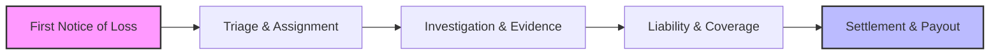
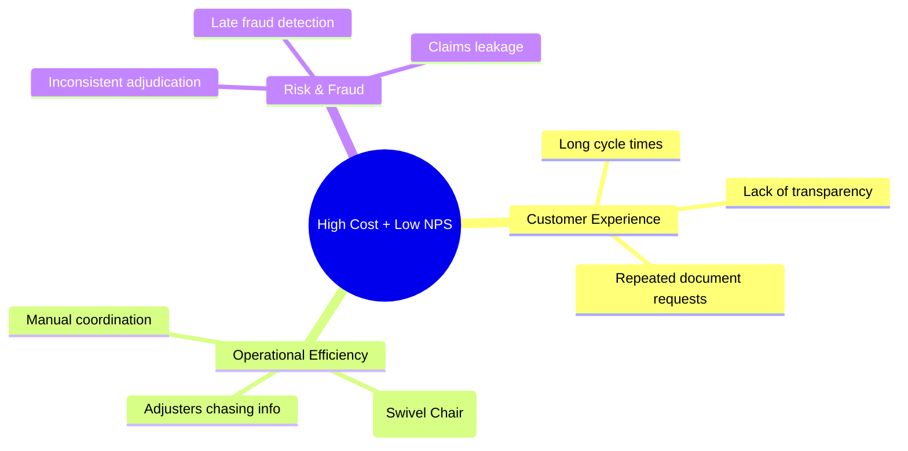
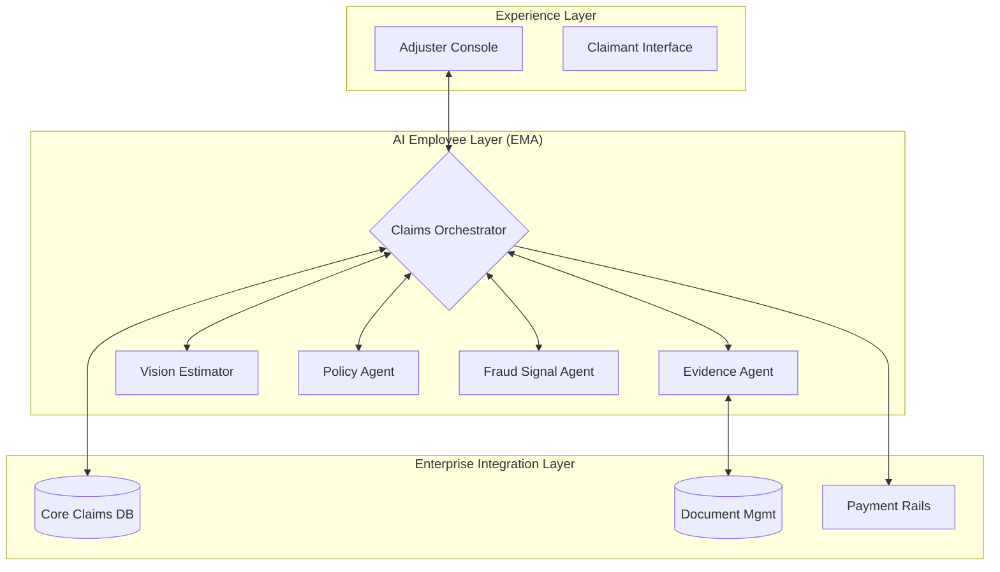

# EMA: The Universal AI Employee for Insurance Claims


**EMA (Enterprise Multi-Agent Assistant)** is an autonomous, agentic AI system designed to revolutionize the motor claims lifecycle. It moves beyond simple chatbots to act as a proactive "Universal AI Employee" that can execute complex workflows, analyze unstructured data, and make intelligent decisions.

---

## 📉 Industry Context: The "Claims Crisis"

Motor insurance is a high-frequency, moderate-severity business. The claims process is the core "moment of truth" for customers, yet it is bogged down by manual work.

### The End-to-End Claims Value Chain
Currently, this process involves multiple handoffs and dependencies on external partners.



### The Pain Points (MECE Problem Tree)
The core problem is **"High Cost + Low NPS"**.



---

## 🧠 Core Concept: Agentic AI as the Step-Change

Legacy automation (RPA) waits for humans to decide. **Agentic AI** reverses this. EMA is an AI employee that can:
1.  **Autonomously Reason**: "This photo shows damage inconsistent with the description."
2.  **Plan**: "I need to ask the claimant for a police report."
3.  **Act**: Sends the email, updates the DB, and triggers the payment.

### The Solution: EMA Claims Orchestrator
EMA acts as a layer of intelligence on top of your existing systems.



---

## 🤖 Agent Pod Design

EMA isn't a single model; it's a coordinated pod of specialized agents.

| Agent | Role | Capabilities |
|-------|------|--------------|
| **Intake Sync Agent** | The Scribe | Retrieves claim/FNOL data, creates case files. |
| **Evidence Agent** | The Investigator | Interacts with claimants, chases documents, reads emails. |
| **Vision Damage Agent** | The Appraiser | Uses Computer Vision to estimate repair costs from photos. |
| **Policy Agent** | The Lawyer | Translates PDF policies into executable code/rules. |
| **Fraud Signal Agent** | The Detective | Performs anomaly detection and SIU flagging. |

---

## 📱 Prototype Journey & Wireframes

The current prototype demonstrates the "Happy Path" for a Type A/B (Low/Medium Complexity) claim.

### 1. The Command Center (Dashboard)
*   **Visual**: A unified workspace showing the **Claims Inbox**.
*   **Feature**: "Risk Score" column pre-calculated by the Orchestrator.
*   **Action**: Adjusters can sort by "Severity" to prioritize work.

### 2. Claim 360 & Evidence Graph
*   **Visual**: A dynamic graph visualization.
*   **Concept**: All entities (Claimant, Vehicle, Photos, Policy) are nodes. As agents work, they add edges (relationships) to this graph.
*   **UI**: The **Agent Activity Log** on the right shows real-time updates ("Verified Coverage", "Flagged Risk").

### 3. Smart Document Analysis
*   **Visual**: Split screen. PDF on the left, Extracted Data on the right.
*   **Tech**: GPT-4o reads raw repair estimates.
*   **Outcome**: Converts unstructured PDF text into structured Line Items (Parts, Labor, Tax) and validates against policy limits.

### 4. Settlement Recommendation
*   **Visual**: A drawer/modal popping up from the bottom.
*   **Content**: Recommended Payout Amount, Confidence Score, and "Approve" button.
*   **Governance**: High-value payouts require human click; low-value can be auto-approved (future scope).

---

## 🛠️ Technology Stack

*   **Frontend**: Next.js 14 (App Router), Tailwind CSS, React Flow (for graphs).
*   **Backend**: FastAPI (Python), Pydantic.
*   **AI Orchestration**: LangChain & LangGraph.
*   **LLM**: Azure OpenAI Service (GPT-4o).
*   **Database**: Supabase (PostgreSQL).

---

## 📦 Installation & Setup

1.  **Clone**: `git clone https://github.com/Kulraj69/ema.git`
2.  **Backend**:
    ```bash
    cd backend
    python -m venv venv
    source venv/bin/activate
    pip install -r requirements.txt
    uvicorn main:app --reload
    ```
3.  **Frontend**:
    ```bash
    cd frontend
    npm install
    npm run dev
    ```

---

## 📄 License
MIT
